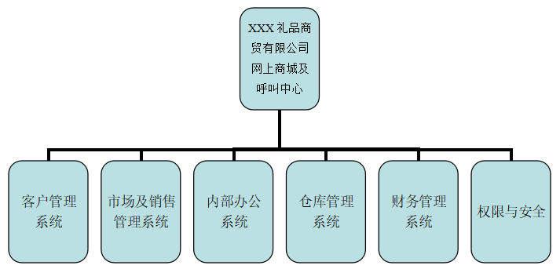

# XXX公司全国销售管理系统

## 背景说明

### 【礼品行业整体背景】

礼品业在我国是一个年轻的行业，二十世纪八十年代，由于国内经济的快速发展，企业在公关、福利、促销上的消费量急剧增加，促使礼品业从众多行业中独立出来，并迅速成长。经过20多年的发展，现在我国已成为世界上最大的礼品生产国和出口国，年产值达8000亿元以上，年均增长速度超过12%。目前我国礼品生产企业过万家，一些企业年产值已超亿元，并且形成了不少集中的区域生产基地。到了90年代中后期，礼品市场的需求不断扩大，由于这个行业进入门槛低，许多投资者都开始介入这个行业。礼品公司如雨后春笋般开始大量涌现。竞争的激烈和信息渠道的畅通使得暴利时代终结，剩下的就只能是价格和服务的竞争。这个时期的礼品公司专业性还不是很强，基本是客户需要什么他们就提供什么，对整体策划、客户服务、产品研发等做的还不是很到位，业务发展对人际关系的依赖性较强。进入二十一世纪以来，礼品业逐渐完善，现在的礼品业已经发展成为一个专业性很强的行业，内部开始细化，有的专攻广告促销品，有的专做实用性礼品，有的则开始走向了连锁加盟的模式。一些礼品公司也已经不再简单地进行礼品买卖，而且可以溶入客户的企业文化背景，针对其要求提供最佳的礼赠品解决方案、开发专属的礼品。2009年，全球经济危机爆发影响传统礼品市场的发展，一批传统礼品企业开始寻找集约型经营模式，进军电子商务领域。体系化、品牌化的礼品专营企业是未来礼品行业发展的必然。

### 【公司背景】
XXX公司创建于1993年。经过多年的努力发展，公司在全国范围30个省会城市都已经建立了稳定的经销商，并有临时零星采购客户3000多家分布于全国各大中城市。因企业外部环境发生了变化，公司开始考虑进行集约化经营模式，进军电子商务领域，将全国市场资源进行整合形成有自身特色的经营体系，提升企业核心竞争能力。

### 【业务背景】

随着公司业务的战略转移，运用电子商务的力量对全国经销商资源进行整合，对线上和线下进行双重营销即：线上由总部通过电子商城形式进行网上营销，形成品牌拉力。全国各城市的实体经销商进行跟踪贴身营销服务，缩短服务距离与时间形成有效竞争优势，总部建立呼叫中心对各经销点的营销服务质量进行监管，同时可以有效防止经销商间的相互窜货的恶意竞争问题。

目前礼品商贸公司较多的模式是独自一家建立电子商城，在全国范围进行业务，不适合礼品行业的看样定制、交货要求及时的特点。

## 项目说明

### 【问题说明】
根据本企业的实际情况，需有一套网上商城系统，基本要求有企业相关信息的发布、总部产品发布、经总部审核各区域经销商自有经销产品发布，及联接此系统的销售管理系统：订单系统、各经销点的库存状况、销售回款及历史价格的查询、销售统计等。

### 【用户期望】
+ 网上商城  主要是为电子商务业务的开展提供便捷、快速的服务，主要功能用于实现：电子商务的B2C开店模式管理、渠道分销中签约经销商的全程电子商务管理、临时零星终端会员在线购物的全程电子商务管理。具体的基本功能要求如下：
    + 设置产品上架
    + 设置产品价格及积分标准
    + 设置产品分类、图片及参数
    + 设置产品特殊分组(特价、新品、热销、精品等) 
    + 产品库存查询
    + 文章发布管理
    + 广告发布管理
+ 客户管理  系统要以客户管理为中心的管理，以“客户”为中心进行销售过程的全部跟踪管理。客户按签约经销商与终端会员二大类进行分级管理，具体的基本功能要求如下：
    + 客户基本信息管理
    + 客户分类管理
    + 客户售前/售中/售后管理
    + 客户信用管理
    + 客户综合分析
+ 市场及销售管理  其主要具体功能要求如下：
    + 供应商管理
    + 竞争对手管理
    + 市场活动管理
    + 广告发布管理
    + 销售目标及合同管理
+ 内部办公及员工管理 其主要具体功能要求如下：
    + 员工基本信息
    + 工作过程及费用管理
    + 公告、通讯及文档管理
    + 事务计划及来电速记等。
+ 仓库管理 其主要具体功能要求如下：
    + 产品管理，仓库管理，出入库审核及库存分析
+ 财务管理  其主要具体功能要求如下：
    + 银行帐号管理、现金银行、收入支出管理、账簿查询分析
+ 权限管理 其主要具体功能要求如下：
    + 总部员工的分级管理权限、经销商权限管理、产品权限管理

## 任务要求

### 系统总体结构

### 项目技术要求
+ 平台开发要求基于微软Windows
+ 采用开发技术ASP.NET（C#）
+ 产品架构要求第二代架构B/S，实现Web 远程操作
+ 应用服务器：IIS6.0
+ 数据库服务器:SQL Server 
+ 要求考虑到系统的针对性，安全性和可操作性

### 实现周期及服务期限
+ 三个月内实现，后续服务二年

### 费用总计投入
+ 软件开发费用：30万元
+ 软件服务费用：3万元/年*二年=6万元
+ 总计费用：30+6=36万元